# Manual Pengguna — Perpustakaan Offline

> **English version below** — scroll ke bawah untuk versi Bahasa Inggris.

Manual ini ditujukan untuk **pustakawan / operator** sekolah atau madrasah yang akan
menggunakan aplikasi sehari-hari, bukan untuk developer. Semua fitur dijelaskan
sesuai urutan menu di sidebar.

> Tip cetak: dokumen ini bisa dibuka di GitHub web, atau di-export ke PDF dengan
> `pandoc docs/manual.md -o manual.pdf`.

---

## Daftar Isi

1. [Instalasi & Jalankan Pertama Kali](#instalasi--jalankan-pertama-kali)
2. [Login & Akun](#login--akun)
3. [Dashboard](#dashboard)
4. [Master Data — Anggota](#master-data--anggota)
5. [Master Data — Buku](#master-data--buku)
6. [Transaksi — Kunjungan](#transaksi--kunjungan)
7. [Transaksi — Peminjaman](#transaksi--peminjaman)
8. [Transaksi — Pengembalian](#transaksi--pengembalian)
9. [Laporan](#laporan)
10. [Setting](#setting)
11. [Backup, Reset, & Lokasi Data](#backup-reset--lokasi-data)
12. [Cetak (KTA, Label Barcode, Bebas Pustaka)](#cetak-kta-label-barcode-bebas-pustaka)
13. [Sync ke Google Sheets (Opsional)](#sync-ke-google-sheets-opsional)
14. [Troubleshooting](#troubleshooting)

---

## Instalasi & Jalankan Pertama Kali

Aplikasi tersedia dalam **2 bentuk** — pilih sesuai preferensi:

### A. Installer (Setup wizard, recommended)

1. Download `PerpustakaanOffline-Setup-vX.Y.Z.exe` dari [halaman Releases](https://github.com/alviarts/perpustakaan-offline/releases)
2. Klik 2x file Setup → ikuti wizard (Next → Next → Install)
3. Aplikasi akan terinstall ke `C:\Program Files\Perpustakaan Offline\`
4. Shortcut otomatis dibuat di **Start Menu** dan **Desktop**
5. Klik shortcut **"Perpustakaan Offline"** untuk menjalankan
6. Untuk uninstall: Control Panel → Programs → Perpustakaan Offline → Uninstall

### B. Portable (single .exe, no install)

1. Download `PerpustakaanOffline.exe` dari [halaman Releases](https://github.com/alviarts/perpustakaan-offline/releases)
2. Letakkan `.exe` di folder mana saja (misal `D:\PerpusApp\`)
3. Klik 2x untuk jalankan — tidak ada proses install
4. Bisa di-copy ke flashdisk dan dipakai di komputer lain (data ikut tidak — lihat [Lokasi Data](#backup-reset--lokasi-data))

### Catatan Windows Defender / SmartScreen

Karena `.exe` belum kami sign dengan code signing certificate, Windows mungkin menampilkan:

> Windows protected your PC

Klik **"More info"** → **"Run anyway"**. Ini normal untuk software open-source yang tidak disigning.

---

## Login & Akun


**Login default pertama kali:**

| Field    | Nilai      |
|----------|------------|
| Username | `admin`    |
| Password | `admin123` |

> ⚠️ **WAJIB ganti password setelah login pertama** — pergi ke
> **Setting → Manajemen Akun → Ganti Password**.

### Daftar Akun Baru

Klik **"Daftar Akun Baru"** di layar login untuk register operator/pustakawan tambahan.
Akun pertama otomatis menjadi **administrator**; akun berikutnya berperan **operator**
(tidak bisa hapus akun lain atau reset DB).

---

## Dashboard

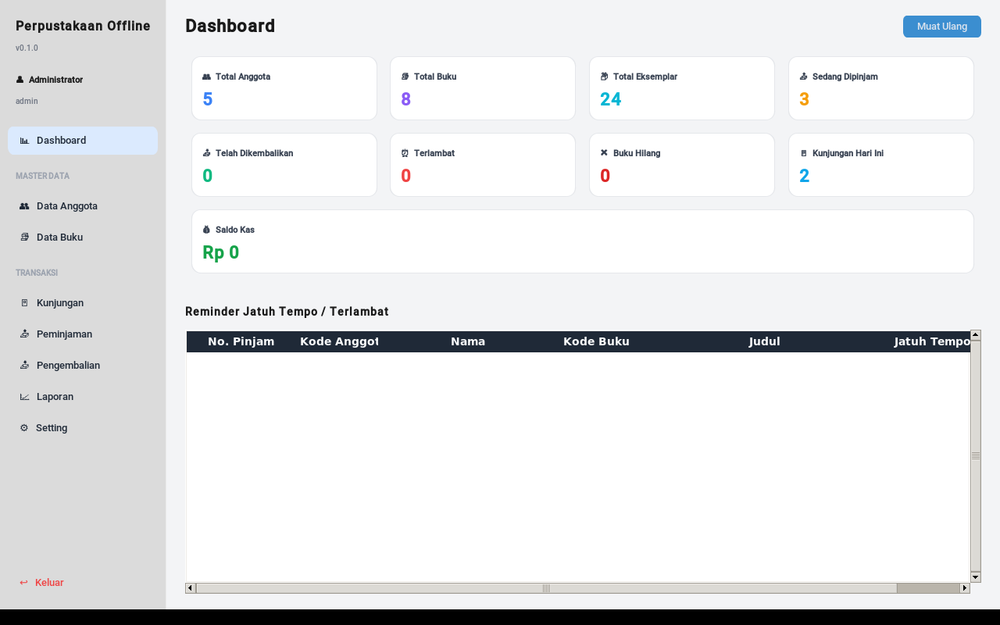

Tampilan ringkasan operasional perpustakaan saat ini:

| Card                     | Penjelasan                                                          |
|--------------------------|---------------------------------------------------------------------|
| **Total Anggota**        | Jumlah anggota aktif (siswa terdaftar)                              |
| **Total Buku**           | Jumlah judul unik (1 judul bisa punya banyak eksemplar)             |
| **Total Eksemplar**      | Jumlah copy fisik buku                                              |
| **Sedang Dipinjam**      | Eksemplar yang sedang keluar / belum dikembalikan                   |
| **Telah Dikembalikan**   | Total transaksi pengembalian sepanjang waktu                        |
| **Terlambat**            | Peminjaman yang lewat tanggal jatuh tempo dan belum dikembalikan    |
| **Buku Hilang**          | Eksemplar yang ditandai hilang (sudah ada ganti rugi atau belum)    |
| **Kunjungan Hari Ini**   | Jumlah catatan kunjungan untuk tanggal hari ini                     |
| **Saldo Kas**            | Akumulasi denda + transaksi kas manual                              |

**Tabel "Reminder Jatuh Tempo / Terlambat"** di bawah menampilkan peminjaman yang:
- Akan jatuh tempo dalam 2 hari (warning)
- Sudah terlambat (merah)

Klik **Muat Ulang** kalau ada perubahan di komputer lain (misal multi-user).

---

## Master Data — Anggota

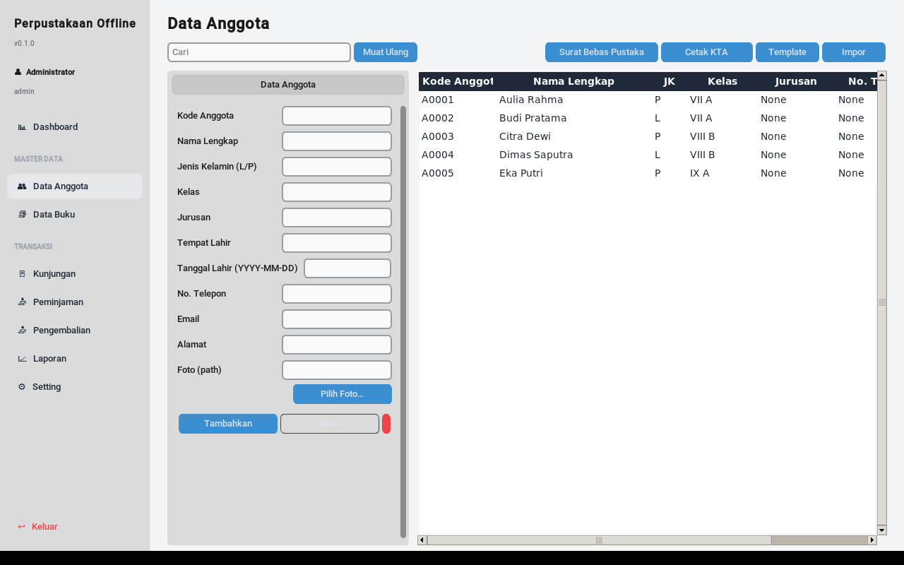

### Tambah Anggota

1. Klik tombol **"Baru"** untuk reset form
2. Isi field minimal: **Nama Lengkap** + **Kelas**
3. **Kode Anggota** akan auto-generate (`A0001`, `A0002`, ...) — tidak perlu diisi manual
4. **Tanggal Lahir** format `YYYY-MM-DD` (mis `2010-08-15`)
5. **Foto (path)** — boleh kosong, atau pilih file via tombol **"Pilih Foto..."** (akan dicopy ke folder data app)
6. Klik **Tambahkan**

### Edit Anggota

1. Klik baris di tabel kanan → form kiri otomatis terisi
2. Ubah field yang perlu
3. Tombol **Tambahkan** akan berubah jadi **Simpan** (otomatis)
4. Klik **Simpan**

### Hapus Anggota

1. Klik baris yang mau dihapus
2. Klik tombol merah di pojok form
3. Konfirmasi → anggota dipindah ke arsip (soft delete) — data lama tetap aman untuk laporan historis

### Import dari Excel

1. Klik **Template** untuk download contoh `.xlsx` dengan kolom yang benar
2. Isi data anggota di Excel (boleh ratusan baris)
3. Klik **Impor** → pilih file → preview → konfirmasi
4. Aplikasi akan skip baris dengan kode anggota duplikat dan kasih laporan

### Cetak KTA (Kartu Tanda Anggota)

1. Klik baris anggota
2. Klik **Cetak KTA** di toolbar
3. PDF KTA ukuran CR80 (kartu nama) terbuka — print di printer kartu PVC, atau cetak biasa lalu laminating

> Lihat [Cetak](#cetak-kta-label-barcode-bebas-pustaka) untuk detail layout & kustomisasi.

### Surat Bebas Pustaka

1. Klik baris anggota (biasanya siswa kelas 9 / 12 yang akan lulus)
2. Klik **Surat Bebas Pustaka**
3. Aplikasi cek: anggota tersebut **tidak punya peminjaman aktif**
4. Kalau lolos → PDF surat bebas pustaka (template resmi) — print
5. Kalau gagal → tampilkan list buku yang masih dipinjam → harus dikembalikan dulu

---

## Master Data — Buku

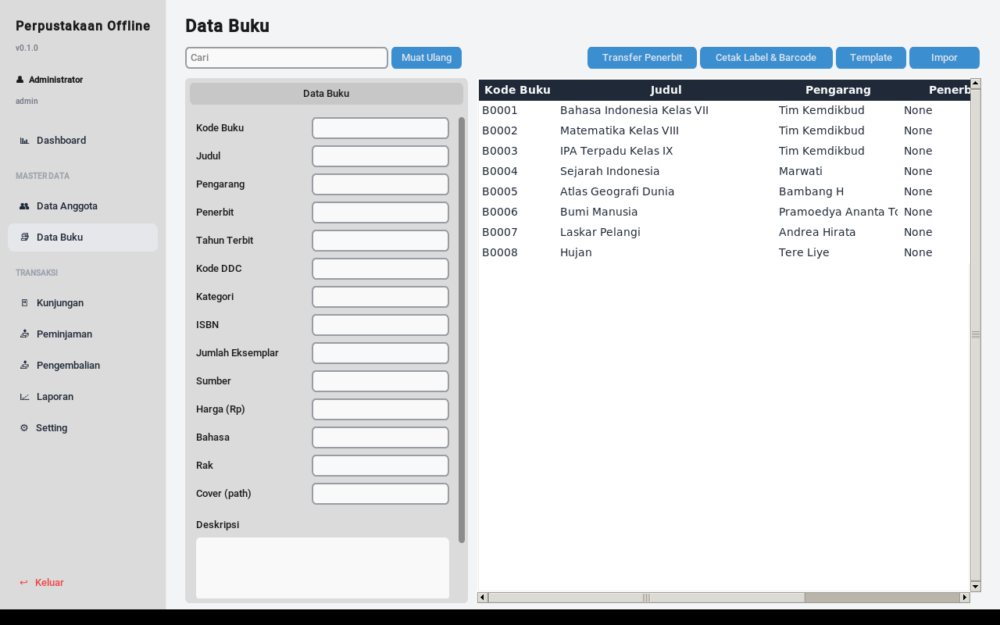

### Tambah Buku

1. Klik **Baru**
2. Isi field minimal: **Judul** + **Pengarang**
3. **Kode Buku** auto-generate (`B0001`, ...)
4. **Kode DDC** — pilih dari klasifikasi Dewey (sudah ter-seed 2.700+ entri saat install). Contoh: `510` = Matematika, `813` = Fiksi Amerika
5. **Jumlah Eksemplar** — berapa copy fisik tersedia (default 1). Sistem akan otomatis bikin entri `B0001-01`, `B0001-02`, dst di tabel `eksemplar`
6. **Harga (Rp)** — dipakai untuk hitung ganti rugi kalau hilang (default `Rp 50.000` bisa diubah di Setting → Transaksi)
7. **Cover (path)** — opsional, foto cover buku
8. Klik **Tambahkan**

### Transfer Penerbit (Dedupe)

Kalau di data ada banyak variasi nama penerbit (misal "Erlangga", "PT Erlangga", "Penerbit Erlangga") yang sebenarnya sama:

1. Klik **Transfer Penerbit**
2. Pilih nama "asli" yang dipakai → pilih nama "duplikat" yang akan dimerge
3. Konfirmasi → semua buku berpenerbit duplikat akan diubah ke yang asli

### Cetak Label & Barcode

1. Klik baris buku (atau Ctrl+klik beberapa baris untuk multi-select)
2. Klik **Cetak Label & Barcode**
3. PDF dengan grid 3×8 label per A4, masing-masing berisi judul + kode + barcode Code 39 — print di kertas label

> Untuk scan barcode: butuh barcode scanner USB biasa (~Rp 100k-300k). Scanner akan
> mengetik kode buku ke field input → cocok untuk peminjaman/pengembalian cepat.

---

## Transaksi — Kunjungan

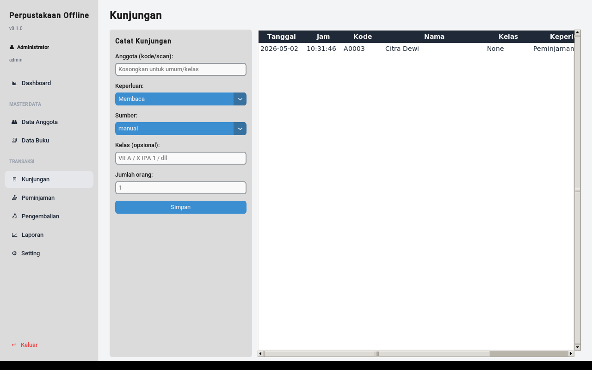

Kunjungan = catatan siapa datang ke perpus (untuk laporan grafik kunjungan).

### Catat Kunjungan Individu

1. Scan barcode KTA siswa, atau ketik kode anggota → Enter
2. Otomatis tercatat dengan timestamp sekarang
3. Form reset → siap untuk siswa berikutnya

### Catat Kunjungan Kelas (Batch)

1. Klik **Kunjungan Kelas**
2. Pilih kelas (mis `VII A`)
3. Centang siswa yang hadir (semua tercentang default)
4. Klik **Simpan** → semua siswa tercentang masuk ke catatan kunjungan dengan timestamp sama

### Hapus Kunjungan

Klik baris di tabel → tombol **Hapus**. Jarang dipakai (biasanya kunjungan dibiarkan utuh untuk audit).

---

## Transaksi — Peminjaman

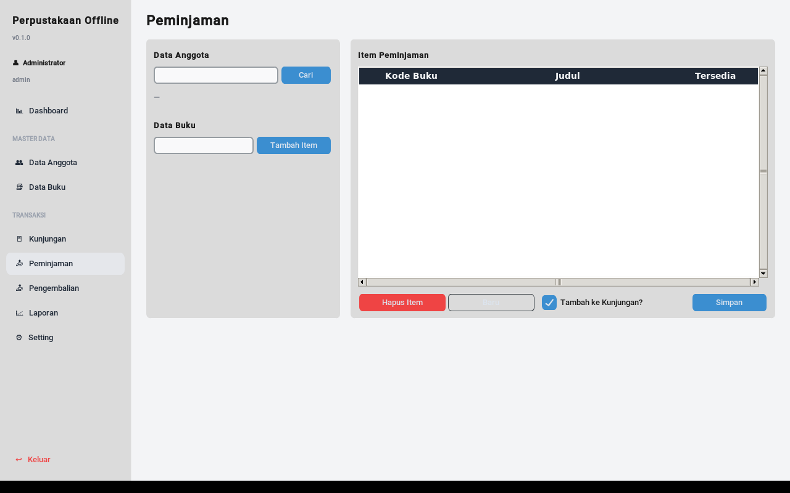

### Alur Peminjaman

1. **Cari Anggota**:
   - Scan barcode KTA, ATAU
   - Ketik kode anggota / nama → klik **Cari**
   - Data anggota muncul di panel kiri (nama, kelas, foto, jumlah peminjaman aktif)
2. **Tambah Buku**:
   - Scan barcode buku, ATAU
   - Ketik kode buku → klik **Tambah Item**
   - Buku masuk ke tabel kanan
3. Ulangi langkah 2 untuk buku ke-2, ke-3, dst (max sesuai setting `max_buku_per_anggota`, default 2)
4. **Tambah ke Kunjungan?** (checkbox) — kalau dicentang, otomatis catat kunjungan untuk anggota ini
5. Klik **Simpan**

### Validasi Otomatis

Sistem akan tolak peminjaman kalau:
- Anggota sudah punya peminjaman aktif >= max_buku_per_anggota
- Buku tidak punya eksemplar tersedia
- Anggota punya peminjaman terlambat (kecuali admin override di Setting)
- Anggota status non-aktif (sudah lulus, dll)

### Tanggal Jatuh Tempo

Otomatis = **tanggal pinjam + lama_pinjam_default** (default 7 hari, ubah di Setting → Transaksi).

---

## Transaksi — Pengembalian

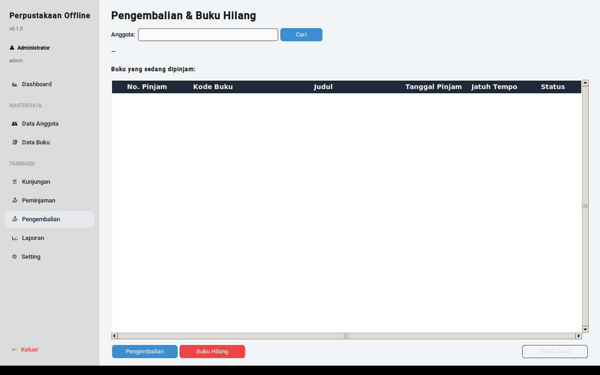

### Alur Pengembalian

1. **Cari Anggota** (scan / ketik kode → Enter)
2. Tabel kanan otomatis ter-load semua peminjaman aktif anggota
3. Centang baris buku yang dikembalikan (atau scan barcode → otomatis tercentang)
4. Sistem hitung **Denda Otomatis** = `(hari_terlambat × denda_per_hari)`
   - default denda Rp 500/hari, ubah di Setting
5. Field **Bayar** — ketik jumlah yang dibayar siswa
6. Field **Catatan** — opsional (mis "buku rusak ringan", "potongan denda karena alasan X")
7. Klik **Simpan**

### Tandai Hilang

Kalau buku tidak dikembalikan dan dianggap hilang:

1. Klik baris peminjaman → klik **Tandai Hilang**
2. Sistem akan charge **harga ganti rugi** = harga buku (atau custom)
3. Kas otomatis tambah masukan
4. Eksemplar status berubah jadi `hilang`, total stok berkurang

---

## Laporan

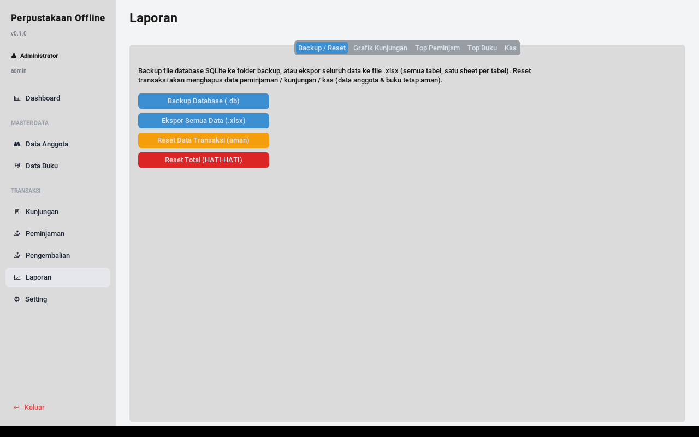

### Tab "Backup / Reset"

| Tombol                            | Fungsi                                                                  |
|-----------------------------------|-------------------------------------------------------------------------|
| **Backup Database (.db)**         | Salin file `perpustakaan.db` ke folder `backup/` dengan timestamp       |
| **Ekspor Semua Data (.xlsx)**     | Export semua tabel ke 1 file `.xlsx`, 1 sheet per tabel (untuk arsip)   |
| **Reset Data Transaksi (aman)**   | Hapus peminjaman + kunjungan + kas, pertahankan data anggota & buku    |
| **Reset Total (HATI-HATI)**       | Hapus semua data, kembali ke kondisi seperti install pertama            |

> ⚠️ Selalu **Backup dulu** sebelum Reset.

### Tab "Grafik Kunjungan"

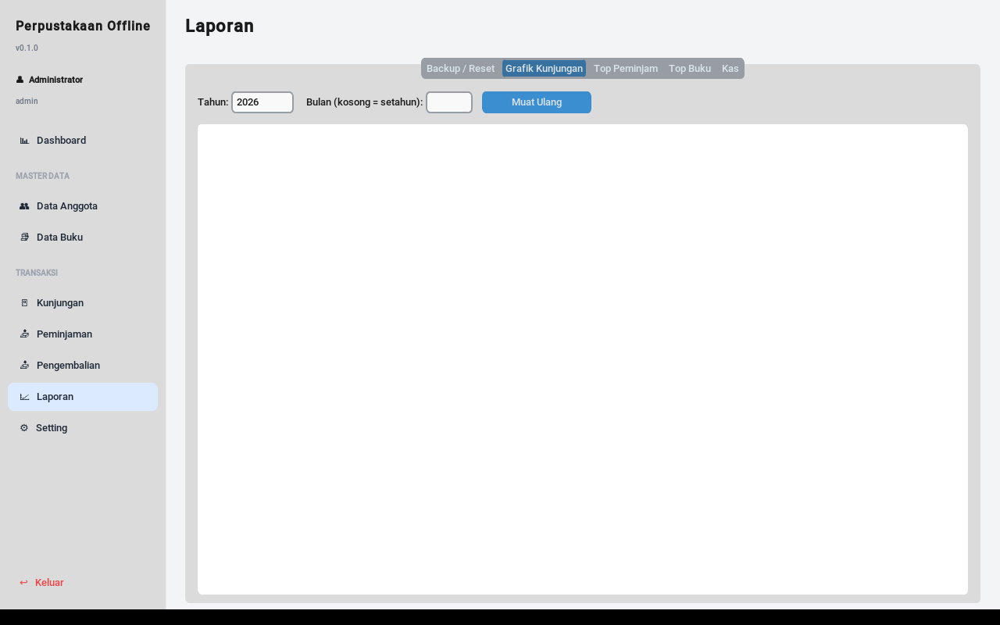

- Pilih **tahun** + **bulan** → grafik bar/line per hari
- Pilih hanya **tahun** → grafik per bulan (12 bar)
- Tombol **Ekspor PNG** untuk save grafik ke gambar

### Tab "Top Peminjam" / "Top Buku"

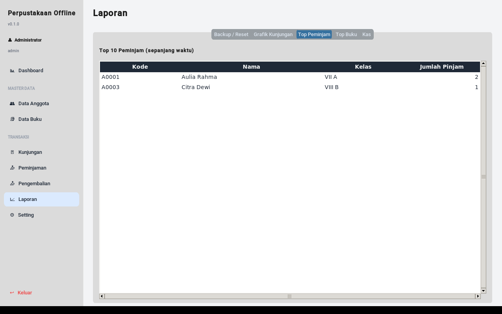

- Daftar anggota dengan jumlah peminjaman terbanyak (sortable)
- Daftar buku paling sering dipinjam
- Filter berdasarkan rentang tanggal

### Tab "Kas"

- List transaksi kas (auto dari denda + manual)
- Saldo akumulasi
- Tombol **Tambah Manual** untuk input pemasukan/pengeluaran custom (mis "beli rak buku Rp 1.500.000")

---

## Setting

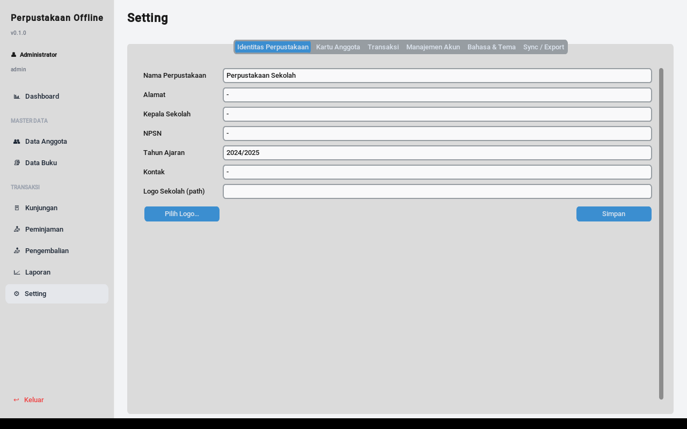

### Tab "Identitas Perpustakaan"

| Field             | Penjelasan                                                       |
|-------------------|------------------------------------------------------------------|
| Nama Perpustakaan | Tampil di header KTA, surat, nota                                |
| Alamat            | Multi-line, tampil di surat resmi                                |
| Kepala Sekolah    | Untuk tanda tangan di surat bebas pustaka                        |
| NPSN              | Nomor Pokok Sekolah Nasional (opsional, tampil di surat)         |
| Tahun Ajaran      | Mis `2024/2025` — tampil di KTA                                  |
| Logo              | Path file logo (PNG/JPG) — akan tampil di kiri atas surat & KTA  |

### Tab "Kartu Anggota"

Customize teks & layout KTA: header, footer, font, ukuran. Preview real-time.

### Tab "Transaksi"

| Field                       | Default | Penjelasan                                            |
|-----------------------------|---------|-------------------------------------------------------|
| `lama_pinjam_default`       | 7       | Hari peminjaman default                               |
| `max_buku_per_anggota`      | 2       | Maksimal buku boleh dipinjam bersamaan                |
| `denda_per_hari`            | 500     | Rupiah per hari terlambat                             |
| `harga_ganti_rugi_default`  | 50000   | Default harga buku hilang (kalau buku tidak ada harga)|
| `boleh_pinjam_terlambat`    | false   | Boleh pinjam baru kalau ada terlambat?                |

### Tab "Manajemen Akun"

- List akun terdaftar
- Tombol **Daftar Baru**, **Edit**, **Reset Password**, **Hapus**
- **Ganti Password Saya** — wajib pakai ini setelah login pertama!

### Tab "Bahasa & Tema"

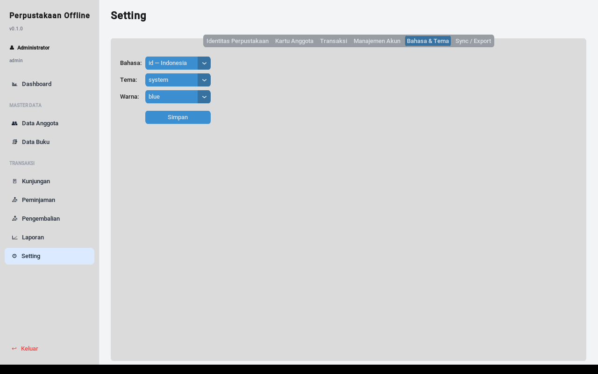

| Field   | Pilihan                                |
|---------|----------------------------------------|
| Bahasa  | `id — Indonesia` / `en — English`      |
| Tema    | `system` / `light` / `dark`            |
| Warna   | `blue` / `green` / `dark-blue`         |

Klik **Simpan** → UI berubah live tanpa restart.

### Tab "Sync / Export"

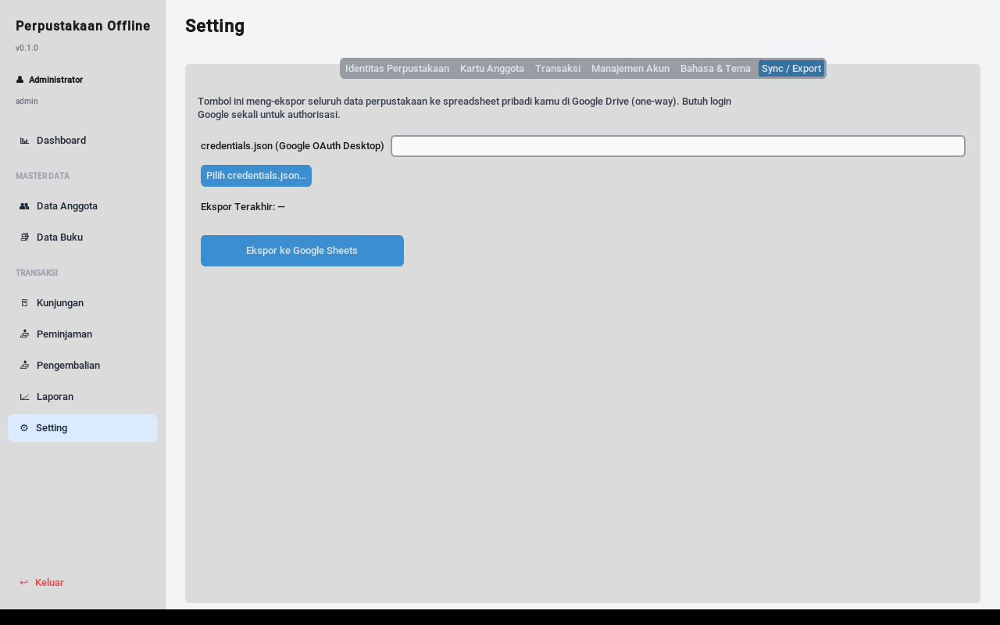

Untuk export manual ke Google Sheets — lihat
[Sync ke Google Sheets](#sync-ke-google-sheets-opsional).

---

## Backup, Reset, & Lokasi Data

### Lokasi Data

| OS       | Path                                                        |
|----------|-------------------------------------------------------------|
| Windows  | `%APPDATA%\PerpustakaanOffline\`                            |
| macOS    | `~/Library/Application Support/PerpustakaanOffline/`        |
| Linux    | `~/.local/share/PerpustakaanOffline/`                       |

Isi folder:
```
PerpustakaanOffline/
├── perpustakaan.db        # database SQLite (semua data)
├── backup/                # auto-backup (.db dengan timestamp)
├── exports/               # output PDF, .xlsx, gambar
├── photos/                # foto anggota
└── covers/                # cover buku
```

### Backup Manual

**Cara 1 — Lewat aplikasi**: Laporan → Backup / Reset → **Backup Database (.db)**

**Cara 2 — Manual file copy**: Copy seluruh folder di atas ke flashdisk / hard disk eksternal / Google Drive.

### Restore dari Backup

1. Tutup aplikasi
2. Replace `perpustakaan.db` di folder data dengan file backup
3. Buka aplikasi → data sudah pulih

### Pindah ke Komputer Lain

1. Copy seluruh folder data ke komputer baru
2. Install aplikasi di komputer baru
3. Buka — data otomatis ter-load

---

## Cetak (KTA, Label Barcode, Bebas Pustaka)

### Format Output

| Cetakan          | Ukuran     | File              | Tools yang sesuai           |
|------------------|------------|-------------------|-----------------------------|
| KTA Anggota      | CR80 (kartu) | PDF               | Printer kartu PVC, atau A4 + laminating |
| Label Buku       | 70×30mm grid 3×8 | PDF (A4)      | Kertas label sticker A4 (Tom & Jerry, Avery) |
| Surat Bebas Pustaka | A4       | PDF               | Printer biasa               |
| Nota Peminjaman  | 80mm thermal | PDF (struk)     | Printer thermal struk (opsional) |

### Cetak Beberapa KTA Sekaligus

1. Di Master Anggota, Ctrl+klik beberapa baris (atau Shift+klik untuk range)
2. Klik **Cetak KTA**
3. PDF gabungan dengan semua KTA dalam 1 file → print sekaligus

### Tip: Barcode Scanner

Scanner USB biasa cukup. Mode **HID Keyboard Wedge** (default scanner USB) — scan barcode = sama seperti ngetik kode + Enter. Cocok untuk semua field input di aplikasi.

---

## Sync ke Google Sheets (Opsional)

Aplikasi 100% offline by default. Kalau ingin **export manual** data ke Google Sheets pribadi (untuk view di browser dari mana saja, sharing dengan kepala sekolah, dll):

**Lihat panduan lengkap:** [docs/google-sheets-setup.md](google-sheets-setup.md)

Singkatnya:
1. Setup OAuth client di Google Cloud Console (gratis)
2. Download `client_secret.json` → letakkan di folder data aplikasi
3. Setting → Sync / Export → klik **Login Google** (browser terbuka, login akun Google)
4. Klik **Push ke Google Sheets** → semua data ter-export ke spreadsheet baru di Drive kamu

> Sync 2-arah otomatis (Opsi A di roadmap) belum tersedia di v0.1; planning di v0.5.

---

## Troubleshooting

### "Windows protected your PC" saat buka .exe

→ Klik **More info** → **Run anyway**. Normal untuk software open-source belum disigning.

### Aplikasi tidak buka, layar hitam, langsung close

1. Jalankan dari Command Prompt: `PerpustakaanOffline.exe` → lihat error message
2. Cek log di folder data: `%APPDATA%\PerpustakaanOffline\app.log`
3. Coba hapus DB: rename `perpustakaan.db` → `perpustakaan.db.bak` → buka app (akan bikin DB baru, tapi data hilang — backup dulu!)
4. Buka [GitHub Issues](https://github.com/alviarts/perpustakaan-offline/issues) untuk lapor bug

### Login gagal "username/password salah"

- Default: `admin` / `admin123`
- Kalau lupa password admin: hapus DB (data hilang!) atau lihat instruksi reset password di [docs/reset-password.md](reset-password.md) (TBD di v0.2)

### Barcode scanner tidak bekerja

- Pastikan scanner di mode **HID Keyboard** (lihat manual scanner)
- Test di Notepad — scan barcode harus muncul sebagai teks
- Pastikan field input aplikasi sudah dalam keadaan focus

### Cetak PDF tidak muncul

- Cek folder `exports/` di folder data aplikasi
- Pastikan tidak ada PDF reader yang nge-block (Adobe Reader / SumatraPDF kadang lock file)

### Import Excel error

- Pastikan format file `.xlsx` (bukan `.xls` lama)
- Header kolom harus persis sesuai Template (download dari aplikasi)
- Tanggal harus format `YYYY-MM-DD` (text), bukan format Excel date

---

## Bantuan & Lapor Bug

- **GitHub Issues**: https://github.com/alviarts/perpustakaan-offline/issues
- **GitHub Discussions** (untuk pertanyaan umum): https://github.com/alviarts/perpustakaan-offline/discussions

Saat lapor bug, sertakan:
1. Versi aplikasi (ada di pojok kiri atas: `v0.1.0`)
2. OS Windows (10 / 11)
3. Langkah reproduksi
4. Screenshot / error message
5. Log di `%APPDATA%\PerpustakaanOffline\app.log` (kalau ada)

---

# 🇬🇧 English Version

This is a translated short version of the manual. Indonesian version above is more comprehensive.

## Quick Start

1. Download `PerpustakaanOffline-Setup.exe` (installer) or `PerpustakaanOffline.exe` (portable) from [Releases](https://github.com/alviarts/perpustakaan-offline/releases)
2. Run → Login with `admin` / `admin123` → **change password immediately** (Setting → Account Management)
3. Switch UI language: **Setting → Language & Theme → Language: en — English**

## Main Modules

| Module           | Purpose                                                                |
|------------------|------------------------------------------------------------------------|
| **Dashboard**    | At-a-glance KPIs (members, books, active loans, fines, visits)         |
| **Members**      | Student CRUD, ID card printing, member promotion (next class), clearance letter |
| **Books**        | Book CRUD, multi-copy management, DDC classification, label printing   |
| **Visits**       | Daily visit log (individual or batch by class)                         |
| **Borrow**       | Issue books to members (barcode scan or manual)                        |
| **Return**       | Process returns, calculate overdue fines, mark lost books              |
| **Reports**      | Backup/Restore, charts, top borrowers, top books, finance ledger       |
| **Settings**     | Library identity, transaction parameters, accounts, language, theme    |

## Data Location

- **Windows**: `%APPDATA%\PerpustakaanOffline\`
- **macOS**: `~/Library/Application Support/PerpustakaanOffline/`
- **Linux**: `~/.local/share/PerpustakaanOffline/`

Backup the entire folder to preserve all data.

## Default Login

- Username: `admin`
- Password: `admin123`
- **Must change after first login!**

## Default Transaction Settings

| Setting                  | Default     |
|--------------------------|-------------|
| Loan duration            | 7 days      |
| Max books per member     | 2           |
| Fine per overdue day     | Rp 500      |
| Default replacement cost | Rp 50,000   |

Adjust in **Setting → Transactions**.

## Bug Reports & Help

- GitHub Issues: https://github.com/alviarts/perpustakaan-offline/issues
- Include version, OS, steps to reproduce, screenshot, and `app.log` content

---

*Manual ini akan diperbarui mengikuti perkembangan aplikasi. Versi terakhir: untuk
v0.1.x. Cek [Releases](https://github.com/alviarts/perpustakaan-offline/releases)
untuk catatan rilis terbaru.*
